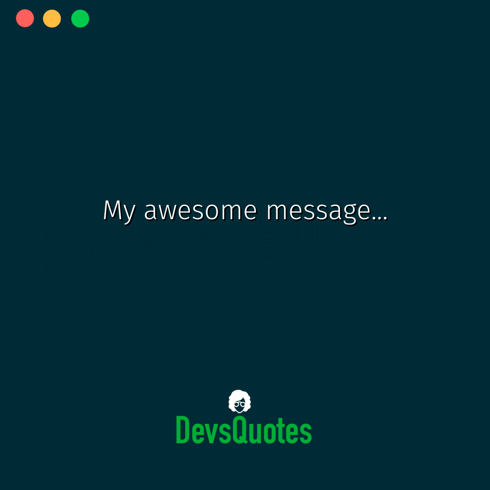

# DevsQuotesPrinter
___

To help me to produce images for my instagram account [DevsQuotes](https://www.instagram.com/devsquotes/) I create this little service which help me to create content just sending the text that I want to appear on the image.

## How to run it?

### Docker
If you have Docker in your machine, is as easy as running:
```shell
make docker/run TEXT="My awesome message..." 
```
This is what you will get on `assets/cool_img.png`:



### GCP Cloud Functions

Do you want it running on Google Cloud? If you have your account configured and the APIs enabled, just run:

```shell
make gcp/deploy
```

At the end of the execution you will get the URL to make requests. Then just make a POST request with this as payload:

```json
{
	"text": "My awesome message..."
}
```

### Heroku

Just use the deployment button [](https://heroku.com/deploy)

After the deployment is done just make a POST request to your service URL with the following payload:

```json
{
    "text": "My awesome message..."
}
```
